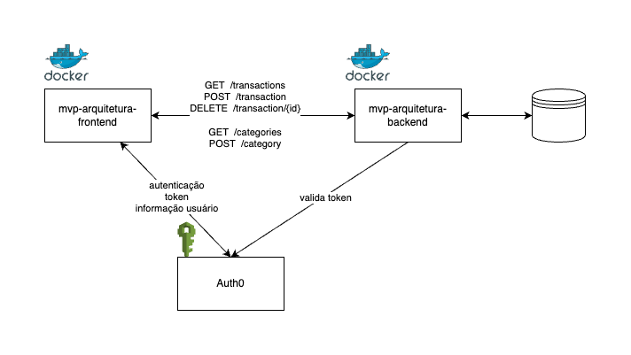

# YourExpenses Frontend

YourExpenses Frontend é a parte da interface do usuário do aplicativo YourExpenses, desenvolvido para ajudar os usuários a gerenciar suas transações financeiras de maneira simples e intuitiva.

## Diagrama de Arquitetura


## Funcionalidades

1. **Login pelo Auth0 (API Externa)**
   - A aplicação utiliza Auth0 como provedor de autenticação para gerenciar login, logout e autorização de usuários.
   - Auth0 possui uma versão gratuita com limitações e planos pagos para funcionalidades avançadas.
   - É necessário criar uma conta no Auth0 e Criar uma aplicação SPA e configurar Allowed Callback URLs e Allowed Web Origins e configurar o arquivo .env com as variáveis de ambiente. Mais detalhes na seção 'Instruções de Uso'.
   - **Rotas chamadas**:
     - `GET /u/login`: Quando o usuário clica em "Login", inicia o fluxo de autenticação no Auth0.
     - `POST /oauth/token`: Obtém um Access Token para autenticação na API e traz informações do usuário.

2. **Tabela de Transações**:
   - Exibe transações do tipo `deposit` e `withdrawal`.
   - Cada transação inclui detalhes como descrição, data e valor.
   - Os usuários podem adicionar e deletar transações.
   - Os usuários podem adicionar categorias.

3. **Dashboard**:
   - Mostra o total de `deposits`.
   - Mostra o total de `withdrawals`.
   - Calcula e exibe o saldo total (soma dos `deposits` menos os `withdrawals`).
   - Atualizado automaticamente ao adicionar ou deletar transações.

## Instruções de Uso
### Requisitos
- Docker

### Passo a passo
Para executar o aplicativo, siga os passos abaixo:

1. Clone este repositório:

   ```bash
   git clone https://github.com/gutakeda/mvp-arquitetura-frontend.git
   cd mvp-arquitetura-frontend
   ```

2. Crie o arquivo .env na raiz do projeto e adicione as seguintes variáveis de ambiente:
   ```bash
    VITE_AUTH0_DOMAIN=...
    VITE_AUTH0_CLIENT_ID=...
    VITE_AUTH0_API_AUDIENCE=...
   ```

3. Crie a imagem local

   ```bash
   docker build -t mvp-arquitetura-frontend .
   ```

4. Rode a imagem

   ```bash
   docker run --env-file .env -p 8080:80 mvp-arquitetura-frontend
   ```

5. O container está disponível na porta 8080
   ```
   http://localhost:8080
   ```

## Licença

Este projeto está licenciado sob a Licença MIT - veja o arquivo [LICENSE.md](LICENSE.md) para mais detalhes.

---

Esperamos que você aproveite o uso do YourExpenses para organizar suas finanças de maneira mais eficiente!
